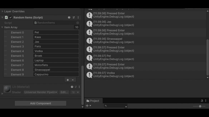

# Les1.2 - Week 1 – Array en List
## Beschrijving
Deze les heb ik herhaald de belangrijke programmeerconcepten in de context van Unity en C#. 
## Wat heb ik gemaakt.
- Ik heb een nieuw C#-script gemaakt waarin tien verschillende items als string kunnen worden opgeslagen.
- Ik heb het in Unity beschikbaar gemaakt met behulp van ```[SerializeField].``` 
- Daarna heb ik een functie gemaakt die willekeurug één van deze tien items in de console print wanneer ik op "Enter" druk.
- Ook heb ik een functie gemaakt die alle items in de console print wanneer ik op de "Escape" druk.
## Demo

## Code 
```code
using UnityEngine;

public class RandomItems : MonoBehaviour
{
    [SerializeField]
    private string[] itemArray = new string[10]
    {
        "Pet", "Kaas", "Jas", "Fiets", "Vodka", "Broek", "Laptop", "Motorfiets", "Sinassappel", "Cappucino"
    };

    private void Update()
    {
        if (Input.GetKeyDown(KeyCode.Return)) PrintRandomItem();
        if (Input.GetKeyDown(KeyCode.Escape)) PrintAllItems();
    }
    private void PrintRandomItem()
    {
        int randomIndex = Random.Range(0, itemArray.Length);
        Debug.Log("Pressed Enter");
        Debug.Log(itemArray[randomIndex]);
    }
    private void PrintAllItems()
    {
        Debug.Log("--- Alle Items ---");

        for (int i = 0; i < itemArray.Length; i++) 
        {
            Debug.Log($"Element {i}: {itemArray[i]}");
        }
    }
}

```