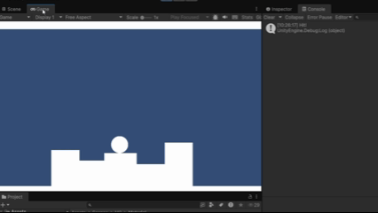

# Les2.1 - Week 2 – Forces & collision
## Beschrijving
Deze les heb ik een nieuwe feature toe gevoegd aan mijn project. 
## Wat heb ik gemaakt.
Ik heb een Unity scene gemaakt waarin de bal met AddForce wordt afgeschoten. Targets in mijn scene waarop de bal kan botsen en een werkende collision detectie met OnCollisionEnter.
## Wat heb ik geleerd.
- Ik heb geleerd hoe wordt de bal met AddForce afgeschoten.
## Demo

## Code (voor ShootBal)
``` Csharp
public class ShootBal : MonoBehaviour
{
    public float ShootForce = 500f;

    public Vector3 Direction = new Vector3(1, 0, 1);

    private Rigidbody2D rb;

    private void Start()
    {
        rb = GetComponent<Rigidbody2D>();
    }
    private void Update()
    {
        if (Input.GetKeyDown(KeyCode.A))
        {
            rb.AddForce(Direction * ShootForce);
        }
    }

}
```
## Code (voor TargetCollision)
```Csharp
using UnityEngine;

public class TargetCollision : MonoBehaviour
{
    private void OnCollisionEnter2D(Collision2D collision)
    {
        Debug.Log("Hit!");
    }
}
```


