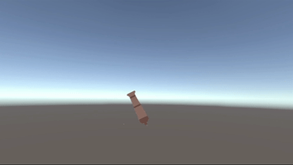

# Les2.2 - Week 2 – Aim, Shoot en Line

## Wat heb ik gemaakt.
- Ik heb een mikmechanisme gebouwd waarbij een kanon in Unity dynamisch naar de muiscursor draait met behulp van een eigen script.
- Ik heb een schietmechanisme gemaakt waarbij een kanon projectielen afvuurt met variebele kracht, afhankelijk van hoe lang de speler de muisknop ingedrukt houdt.
- Ik heb een dynamische LineRenderer toegevoegd die de schietkracht van het kanon visueel weergeeft.
## Demo

## Code (Aim)
```Csharp 
using UnityEngine;

public class Aim : MonoBehaviour
{
    private void Update()
    {
        Vector3 pos = Camera.main.WorldToScreenPoint(transform.position);

        Vector3 dir = Input.mousePosition - pos;

        float angle = Mathf.Atan2(dir.y, dir.x) * Mathf.Rad2Deg;

        transform.rotation = Quaternion.AngleAxis(angle, Vector3.forward);

    }
}
```
## Code (Shoot)
```Csharp
using TMPro;
using UnityEngine;

public class Shoot : MonoBehaviour
{
    [SerializeField] private GameObject prefab;
    [SerializeField] private float forceBuild = 20f;
    [SerializeField] private float maximumHoldTime = 5f;

    private float _pressTimer = 0f;
    private float _launchForce = 0f;

    [SerializeField] private float lineSpeed = 10f;
    private LineRenderer _line;
    private bool _lineActive = false;

    private void Start()
    {
        _line = GetComponent<LineRenderer>();
        _line.SetPosition(1, Vector3.zero);
    }

    private void Update()
    {
        HandleShot();
    }

    private void HandleShot()
    {

        if (_lineActive)
        {
            _line.SetPosition(1, Vector3.right * _pressTimer * lineSpeed);
        }
        if (Input.GetMouseButtonDown(0))
        {
            _pressTimer = 0;

            _pressTimer = 0f;
            _lineActive = true;
            
        }

        if (Input.GetMouseButtonUp(0))
        {
            _launchForce = _pressTimer * forceBuild;
            GameObject ball = Instantiate(prefab, transform.parent);
            ball.transform.rotation = transform.rotation;
            ball.GetComponent<Rigidbody2D>().AddForce(ball.transform.right * _launchForce, ForceMode2D.Impulse);
            ball.transform.position = transform.position;

            _lineActive = false;
            _line.SetPosition(1, Vector3.zero);
            
        }

        if(_pressTimer < maximumHoldTime)
        {
            _pressTimer += Time.deltaTime;
        }

        
    }
}
```