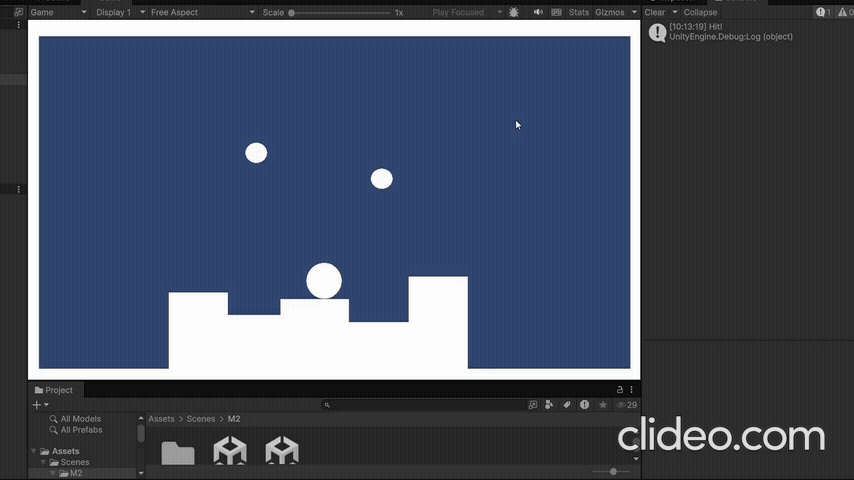

# Les3.1 - Week 3 - Peggle, hits & score
## Beschrijving 
In deze les heb ik de complete basis van mijn Peggle-mechanic gebouwd. Ik maak een Peggle die reageert op de bal, bijhoudt hoeveel hits er nog over zijn, punten doorgeeft aan de ScoreManager en uit het level verdwijnt wanneer de hits op zijn.
## Wat heb ik gemaakt.
- Laat de Peggle bijhouden hoeveel hits er nog over zijn.
- Geef de score door aan de ScoreManager door vanuit het Peggle-script AddScore aan te roepen.
- Gebruik hiervoor Destroy(gameObject).
## Wat heb ik geleerd.
- Ik heb herhaald hoe moet ik Destroy(gameObject) gebruiken.
## Demo 

## Code (Peggle)
```Csharp
using UnityEngine;

public class Peggle : MonoBehaviour
{
    [Header("Peggle Instellingen")]
    [Tooltip("Het aantal hits voordat de Peggle vernietigd wordt.")]
    [SerializeField] private int maxHits = 1;

    [Tooltip("Het aantal punten dat wordt toegekend bij elke hit.")]
    [SerializeField] private int scoreValuePerHit = 10;

    private int remainingHits;

    private void Start()
    {
        remainingHits = maxHits;
    }

    private void OnCollisionEnter2D(Collision2D collision)
    {
        if (collision.gameObject.CompareTag("Ball"))
        {
            HandleHit();
        }
    }
    private void HandleHit()
    {
        remainingHits--;

        if (Scoremanager.Instance != null)
        {
            Scoremanager.Instance.AddScore(scoreValuePerHit);
        }
        Debug.Log("Peggle geraakt! Resterende hits: " + remainingHits);

        if (remainingHits <= 0)
        {
            DestroyPeggle();
        }
    }
    private void DestroyPeggle()
    {
        Destroy(gameObject);
        Debug.Log("Peggle vernietigd!");
        Debug.Log("Peggle vernietigd!");
    }
}

```
## Code (ScoreManager)
``` Csharp
using UnityEngine;

public class Scoremanager : MonoBehaviour
{
    public static Scoremanager Instance;

    private int currentScore = 0;

    private void Awake()
    {
       if (Instance == null)
        {
            Instance = this;  
        }
        else
        {
            Destroy(gameObject);
        }
    }

    public void AddScore(int pointsToAdd)
    {
        currentScore += pointsToAdd;

        Debug.Log("Score toegevoegd: " + pointsToAdd + ". Nieuwe totaale score: " + currentScore);

    }

    public int GetCurrentScore()
    {
        return currentScore;
    }
}
```
