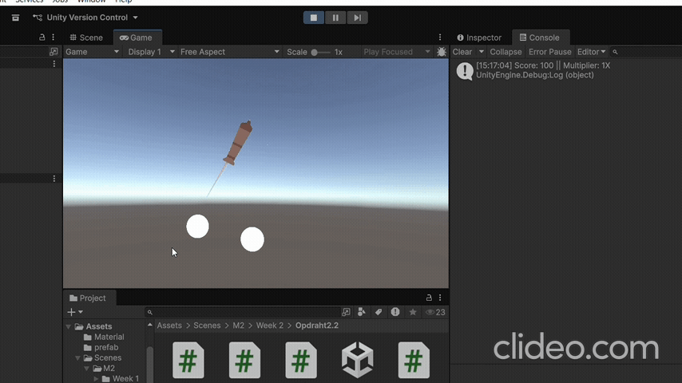

# Les3.2 - Week 3 - (CODE) Peggle Game, Combos, Multiplier, Events
## Beschrijving
Ik heb een combo systeem gemaakt op basis van tags.
## Wat heb ik gemaakt.
Ik heb een combo-score systeem gebouwd in Unity waarbij elke bumper-hit punten oplevert. Als dezelfde bumper meerdere keren achter elkaar geraakt wordt, stijgt de score multiplier. De score wordt dynamisch verhoogd en weergegeven in de console.
## Wat heb ik geleerd.
- Ik heb geleerd hoe je met events (Action<string, int>) informatie kunt doorgeven tussen scripts.
- Ik heb fouten opgelost zoals NullReferenceException en geleerd hoe je een singleton (ScoreManager.Instance) correct instelt.
- Ook heb ik beter leren debuggen en begrijpen hoe Unity objecten en scripts met elkaar communiceren.
## Demo


## Code (BumperHit)
```Csharp
using System;
using UnityEngine;

public class BumperHit : MonoBehaviour
{
    [SerializeField] private int scoreValue = 100;
    public static event Action<string, int> onBumperHit;
    private void OnCollisionEnter2D(Collision2D collision)
    {
        if (collision.gameObject.CompareTag("Ball"))
        {
            onBumperHit?.Invoke(gameObject.tag, scoreValue);

        }
    }
}

```

## Code (ComboSystem)
```Csharp
using NUnit.Framework;
using System.Collections.Generic;
using UnityEngine;
using UnityEngine.SceneManagement;

public class ComboSystem : MonoBehaviour
{
    private List<string> bumperTags = new List<string>();   
    private int scoreMultiplier = 1;
    private void Start()
    {
        BumperHit.onBumperHit += CheckForCombo;             
    }
    private void OnDisable()
    {
        BumperHit.onBumperHit -= CheckForCombo;            
    }
    private void CheckForCombo(string tag, int bumperValue)
    {
        bumperTags.Add(tag);                                
        if (bumperTags.Count > 1)                          
        {                                                   
            if (bumperTags[bumperTags.Count - 2] == bumperTags[bumperTags.Count - 1])
            {
                scoreMultiplier++;                          
            }
            else                                            
            {
                scoreMultiplier = 1;                        
                bumperTags.Clear();                         
            }
        }                                                   
        ScoreManager.Instance.AddScore(bumperValue * scoreMultiplier);

        
        Debug.Log($"Score: {ScoreManager.Instance.GetScore()} || Multiplier: {scoreMultiplier}X");
    }
}

```

## Code (ScoreManager)
```Csharp
using Unity.VisualScripting;
using UnityEngine;

public class ScoreManager : MonoBehaviour
{
    public static ScoreManager Instance;

    private int score = 0;
    private void Awake()
    {
        if (Instance == null)
        {
            Instance = this;
        }
        else
        {
            Destroy(gameObject);
        }
    }

    public void AddScore(int pointsToAdd)
    {
        score += pointsToAdd;

    }
    public int GetScore()
    {
        return score;
    }
    
    
}
```