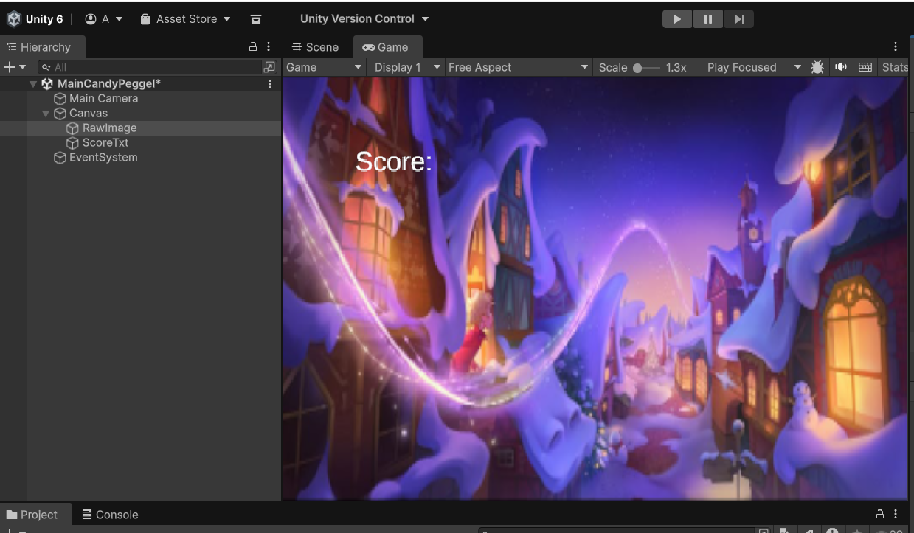

# Les4.1 - Week 4 - Level design & UI Opdracht
## Beschrijving
Ik heb een nieuw level gemaakt voor mijn Peggle-spel.
## Wat heb ik gemaakt.
Ik heb een nieuwe level in Unity gemaakt. Score zichtbaar in de UI. Een geïmporteerd font. Een UI-element dat 9-slice gebruikt. 
## Wat heb ik geleerd.
Ik heb geleerd wat is 9-slice.
## Demo
!

