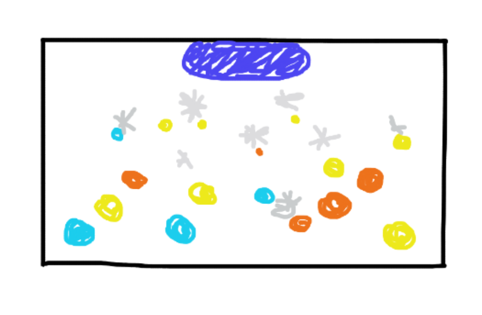

# Titel
Jingle Pegs!

## Genre
Physics-based arcade puzzelgame

## Beschriving
In Peggle Deluxe moet je met een bal bumpers raken om ze te verwijderen. Het doel is om alle bumpers op het scherm te verwijderen voordat je ballen op zijn. Je kunt de bal werpen door de werper te richten en los te laten, waarbij de bal op andere pinnen stuitert om deze te raken. Door slim te spelen en speciale krachten van de meesterpersonages te gebruiken, kun je bonuspunten verdienen en het level voltooien. 

## Gameplaykern
* Bal: da ballen met wit kleur.
* Bumpers: andere ballen met collider.
* Score: punten + sapmeter stijgt.
* Doel: maak een volle smoothie voordat je beurten op zijn.

## Stijl en Sfeer
Kleurrijk, met verschillende ballen.

## Structuur van het level
* Bovenaan: schietplek (de speler richt en vuurt)
* Midden: veld met targets (cirkelvormige of onregelmatige patronen)
* Onderaan: opvangbak of blender (scoreberekening)

## Foto

