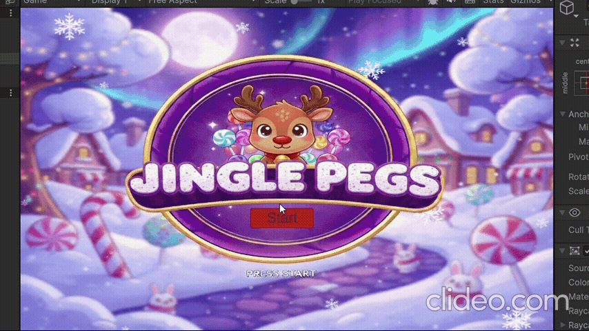
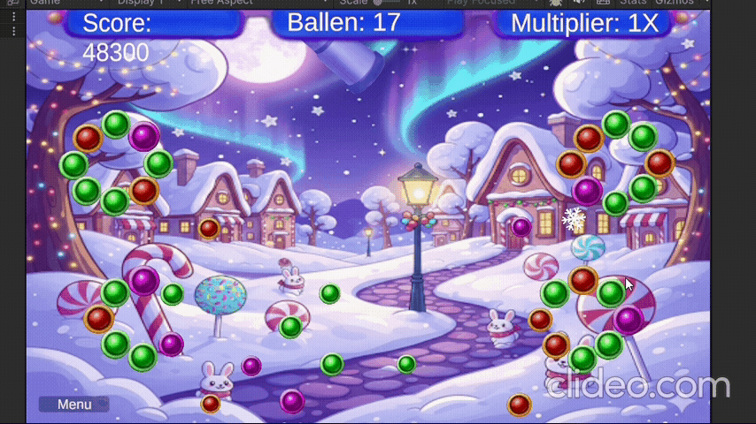
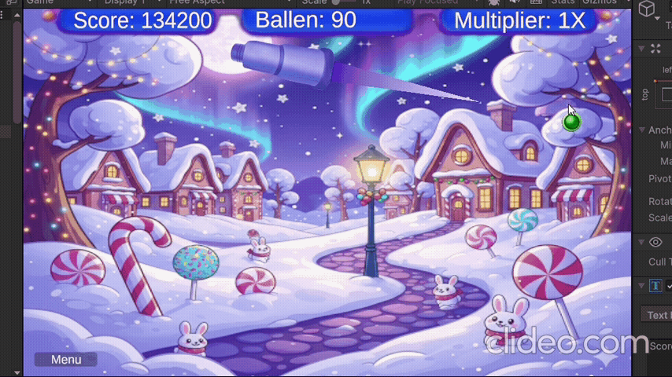

# Les6.1 - Week 6 - Afronden en Uitbreiding
## Beschijving
Een winterse arcade-game in kerstsfeer, gebaseerd op het bekende spel Peggle.
## Demo Start


## Code (Score Manager)
```Scharp
public class ScoreManager : MonoBehaviour
{
    public static ScoreManager Instance;

    private int currentScore = 0;
    private void Awake()
    {
        if (Instance == null)
        {
            Instance = this;
        }
        else
        {
            Destroy(gameObject);
        }
    }

    public void AddScore(int pointsToAdd)
    {
        currentScore += pointsToAdd;

    }
    public int GetScore()
    {
        return currentScore;
    }
}
```
## Code (Voor Button)
```Scharp
using UnityEngine;
using UnityEngine.SceneManagement;

public class ReplayButton : MonoBehaviour
{
    public void OnReplayButtonBressed()
    {
        SceneManager.LoadScene("CandyPeggleMain");
    }

    public void OnMainButtonPressed()
    {
        SceneManager.LoadScene("MainCandyPeggel");
    }
}
```
## Demo Multiplier 


## Code (Bumper Hit)
```Scharp
public class BumperHit : MonoBehaviour
{
    public static event Action<Transform, int> onBumperHit;

    [SerializeField] private int maxHits = 5;
    [SerializeField] private int scoreValue = 100;

    private int currentHits = 0;

    private void OnCollisionEnter2D(Collision2D collision)
    {
        if (collision.gameObject.CompareTag("Ball"))
        {
            currentHits++;

            onBumperHit?.Invoke(transform, scoreValue);


            if (currentHits >= maxHits)
            {
                Destroy(gameObject);
            }
            else
            {
                transform.localScale *= 0.9f;
            }
        }
    }
}
```
## Code (CountBalls)
```Scharp
public class CountBalls : MonoBehaviour
{
    public static event Action onBallLost;
    public static event Action onBallsDepleted;

    public static event Action<int> onBallCountChanged;

    [SerializeField] private int totalBallsShot = 0;
    
    private void Start()
    {
        Shoot.onShootBall += CountOnShot;

        onBallCountChanged?.Invoke(totalBallsShot);
    }

    private void OnDisable()
    {
        Shoot.onShootBall -= CountOnShot;
    }
    private void CountOnShot()
    {
        totalBallsShot++;
        onBallCountChanged?.Invoke(totalBallsShot);
    }
    private void OnTriggerExit2D(Collider2D collision)
    {
        if (collision.gameObject.CompareTag("Ball"))
        {
            onBallLost?.Invoke();
            Destroy(collision.gameObject);
        }
    }
}
```
## Code (Combo System)
```Scharp
public class ComboSystem : MonoBehaviour
{
    public static event Action<int, int> OnScoreChange;

    private List<string> bumperTags = new List<string>();
    private int scoreMultiplier = 1;

    [Header("Multiplier Timer Instellingen")]
    [SerializeField] private float multiplierDuration = 3.0f;
    private float multiplierTimer;
    private void Start()
    {
        BumperHit.onBumperHit += CheckForCombo;
    }
    private void OnDisable()
    {
        BumperHit.onBumperHit -= CheckForCombo;
    }

    private void Update()
    {
        if(scoreMultiplier > 1)
        {
            multiplierTimer -= Time.deltaTime;

            if (multiplierTimer <= 0)
            {
                ResetMultiplier();
            }
        }
    }

    private void CheckForCombo(Transform bumperTransform, int bumperValue)
    {
        string tag = bumperTransform.tag;
        bumperTags.Add(tag);

        multiplierTimer = multiplierDuration;

        if (bumperTags.Count > 1)
        {
            if (bumperTags[bumperTags.Count - 2] == bumperTags[bumperTags.Count - 1])
            {
                scoreMultiplier++;
            }
            else
            {
                scoreMultiplier = 1;
                bumperTags.Clear();
                
            }
        }
        ScoreManager.Instance.AddScore(bumperValue * scoreMultiplier);
        
        OnScoreChange?.Invoke(ScoreManager.Instance.GetScore(), scoreMultiplier);

    }
    private void ResetMultiplier()
    {
        scoreMultiplier = 1;
        bumperTags.Clear();

        OnScoreChange?.Invoke(ScoreManager.Instance.GetScore(), scoreMultiplier);
    }
}
```
## Code (Aim)
```Scharp
public class Aim : MonoBehaviour
{
    private void Update()
    {
        Vector3 pos = Camera.main.WorldToScreenPoint(transform.position);

        Vector3 dir = Input.mousePosition - pos;

        float angle = Mathf.Atan2(dir.y, dir.x) * Mathf.Rad2Deg;

        transform.rotation = Quaternion.AngleAxis(angle, Vector3.forward);

    }
}
```
## Code (Shoot)
```Scharp
public class Shoot : MonoBehaviour
{
 
    public static event Action onShootBall;

    [SerializeField] private GameObject prefab;
    [SerializeField] private float forceBuild = 20f;
    [SerializeField] private float maximumHoldTime = 5f;
    private float _pressTimer = 0f;
    private float _launchForce = 0f;
    private bool _shotEnabled = true;

    [SerializeField] private float lineSpeed = 10f;
    private LineRenderer _line;
    private bool _Lineactive = false;

    private void Start()
    {
        //CountBalls.onBallsDepleted += DisableShot;
        _line = GetComponent<LineRenderer>();
        _line.SetPosition(1, Vector3.zero);
    }
    
    private void OnDisable()
    {
        CountBalls.onBallsDepleted -= DisableShot;
    }
    private void Update()
    {
        if (_shotEnabled) HandleShot();
        
    }
    private void HandleShot()
    {
        if (_Lineactive)
        {
            _line.SetPosition(1, Vector3.right * _pressTimer * lineSpeed);
        }
        if (Input.GetMouseButtonDown(0))
        {
            _pressTimer = 0;

            _pressTimer = 0f;
            _Lineactive = true;
        }
        if (Input.GetMouseButtonUp(0))
        {
            _launchForce = _pressTimer * forceBuild;
            GameObject ball = Instantiate(prefab, transform.parent);
            ball.transform.rotation = transform.rotation;
            ball.GetComponent<Rigidbody2D>().AddForce(ball.transform.right * _launchForce, ForceMode2D.Impulse);
            ball.transform.position = transform.position;

            
            onShootBall?.Invoke();

            _Lineactive = false;
            _line.SetPosition(1, Vector3.zero);
        }
        if (_pressTimer < maximumHoldTime)
        {
            _pressTimer += Time.deltaTime;
        }
    }
    
    private void DisableShot()
    {
        _shotEnabled = true;
    }
}
```
## Demo Einde


## Code (UI Ball Counter)
```Scharp
using UnityEngine;
using TMPro; 

public class UIBallCounter : MonoBehaviour
{
    
    public TMP_Text ballCountField;

    private void Start()
    {
        
        CountBalls.onBallCountChanged += UpdateBallCountUI;
    }

    private void OnDisable()
    {
        CountBalls.onBallCountChanged -= UpdateBallCountUI;
    }

    private void UpdateBallCountUI(int totalShot)
    {
      
        ballCountField.text = $"Ballen: {totalShot}";
    }
}
```
## Code (UI Score Board)
```Scharp
using TMPro;
using UnityEngine;

public class UIScoreBoard : MonoBehaviour
{
    public TMP_Text scoreField;
    public TMP_Text multiplierField;
    
    private void Start()
    {
        ComboSystem.OnScoreChange += UpdateUI;
    }
    private void OnDisable()
    {
        ComboSystem.OnScoreChange -= UpdateUI;
    }
    private void UpdateUI(int score, int multiplier)
    {
        scoreField.text = "Score: " + score;
        multiplierField.text = "Multiplier: " + multiplier + "X";
    }
}
```

